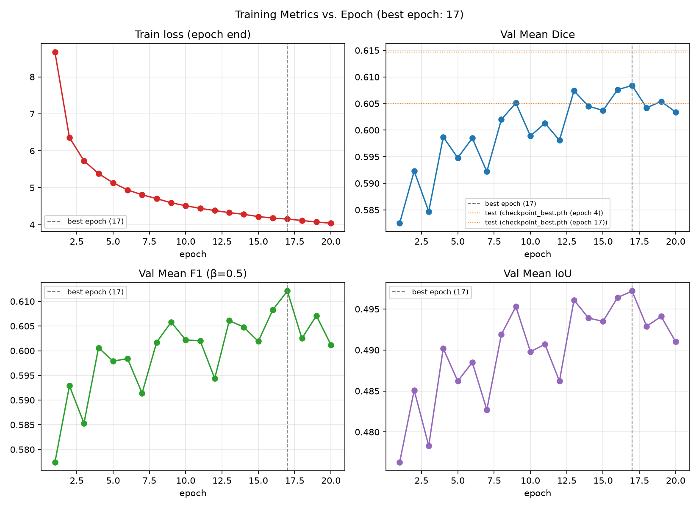

# ImageSegmentation (Mask2Former Traffic Image Segmentation)

**Status: Modular pipeline functional and verified end-to-end (`src/`, `run_pipeline.sh`) — see
[Results](#results) below. Trained weights are published on the Hugging Face Hub — see
[Pretrained Weights](#pretrained-weights). The original notebook (`notebooks/Project.ipynb`)
remains the reference implementation the modular pipeline was built to match. Known open gap: a
handful of classes have no training examples in the current sampled dataset — see Results.**

This project performs semantic segmentation on a dataset of Indian roadways under various conditions. The task involves segmenting diverse and complex roadway scenes, which include multiple object sizes and intricate visual details.

## Model Overview

Our main model for this task is **Mask2Former**, a universal segmentation model capable of performing instance, semantic, and panoptic segmentation. Mask2Former achieves robust performance through several key innovations:

- **Masked Attention:** Utilizes masked attention to localize feature focus around predicted segments, leading to faster convergence and improved segmentation accuracy.
- **Multi-Scale High-Resolution Features:** Effectively segments objects of various sizes by leveraging multi-scale, high-resolution features.
- **Dynamic Mask Prediction:** Predicts dynamic masks rather than per-pixel labels, providing adaptability for complex segmentation tasks.

For finetuning, we froze the encoder backbone and pixel decoder to preserve learned features and finetuned only the transformer decoder and MLP layer, making training more resource-efficient.

## Dataset Preparation

The training dataset initially consisted of 8,000 high-resolution images, but due to computational constraints, we implemented a filtering process to extract the most informative subset of images for finetuning. Our approach used a weighted score system to rank images based on specific criteria:

- **Class Diversity Score (CDS):** Measures the diversity of classes in an image.
- **Rare Class Score (RCS):** Scores images based on the presence of rare classes.
- **Image Count Score (ICS):** Counts images in each subdirectory.

The weighted score is calculated as follows:

    Weighted Score = α * (CDS / max(CDS)) + β * (RCS / max(RCS)) + γ * (ICS / max(ICS))

where α = 0.4, β = 0.45, and γ = 0.15.

Using this ranking, we selected the top-ranked subdirectories for finetuning, yielding **1,350**
images (verified by directly loading the resulting dataset) — split 80% / 10% / 10% into
train/val/test (1,080 / 135 / 135).

**Dataset link:** [Kaggle - Indian Roadways Finetune Dataset](https://www.kaggle.com/datasets/shayakbhattacharya/finetune)

## Model and Training Settings

After preparing the dataset, we used Hugging Face (HF) modules to build the finetuning pipeline. The dataset was converted to the Mask2Former format through a custom pipeline based on the HF dataset structure. This included a custom collate function that returns 6 key items for each image:

- `pixel_values`: Image as a numpy array after transformations
- `pixel_mask`: Regions of the segmentation map to attend to
- `mask_labels`: N masks for objects within the image
- `class_labels`: N class labels for the image objects
- `original_images`: Untransformed images
- `original_segmentation_maps`: Unaltered segmentation maps

Using the Mask2Former preprocessor, each image was further processed into the required model format. We modified the final output layer based on the number of classes in our dataset.

### Baseline Hyperparameters

- Train/Val/Test Split: 80% / 10% / 10%
- Epochs: 5 (baseline notebook run; extended runs up to 20 epochs have since been trained — see
  Results)
- Batch Size: 8
- Optimizer: Adam
- Learning Rate: 5e-5

## Pipeline

The segmentation pipeline integrates:

- Mask2Former as the primary model
- Efficient data processing and inference pipelines to maximize segmentation accuracy and minimize computational overhead.

## Pretrained Weights

The finetuned model (20 epochs, best checkpoint) is published on the Hugging Face Hub:

**[niksixus/Mask2Former-Traffic-Segmentation](https://huggingface.co/niksixus/Mask2Former-Traffic-Segmentation)**

Use it directly without training anything yourself:

```python
from transformers import Mask2FormerForUniversalSegmentation, Mask2FormerImageProcessor

model = Mask2FormerForUniversalSegmentation.from_pretrained(
    "niksixus/Mask2Former-Traffic-Segmentation"
)
processor = Mask2FormerImageProcessor(
    ignore_index=0, do_reduce_labels=False, do_resize=False, do_rescale=False, do_normalize=False,
)
```

The non-default `Mask2FormerImageProcessor` settings matter — this model expects inputs already
resized to 512×512 and normalized (ADE20K mean/std, see `src/config.py`'s `ADE_MEAN`/`ADE_STD`)
upstream, matching how it was trained, rather than the processor's own default preprocessing.
See the model card on the Hub page above for the full class list and the known-missing-classes
caveat (also covered in Results below).

## Results

Trained on an RTX 4090 (RunPod), using `facebook/mask2former-swin-large-ade-semantic` finetuned
with the backbone/pixel decoder frozen (6.7% of parameters trainable):

| Run | Epochs | Test Mean Dice | Test Mean F1 (β=0.5) | Test Mean IoU |
|---|---|---|---|---|
| Notebook baseline | 5 | 0.5563 | 0.5412 | (not recorded) |
| Modular pipeline | 5 | 0.6050 | 0.6036 | 0.4968 |
| Modular pipeline | 20 (5 + resumed 15) | **0.6147** | **0.6193** | **0.5044** |



Full per-epoch metrics (append-only, accumulates across training runs/resumes):
[`results/results.csv`](results/results.csv). `src/train.py` and `evaluate_model.py` append to it
automatically; regenerate the plot above after a new run with:
```bash
python -m src.plot_results
```

**Known limitation:** 5 of the 40 classes (`car`, `pole`, `obs-str-bar-fallback`, `ego vehicle`,
`rectification border`) have zero labeled pixels anywhere in the current sampled 1,350-image
dataset, verified by directly loading it — the model has no training signal for them regardless of
epoch count or loss tuning. Suspected cause: the raw-data curation step (`convert()` in
`notebooks/Project.ipynb`) resizes segmentation masks without nearest-neighbor interpolation,
which can silently erase small/thin classes. Not yet fixed — would require regenerating the
dataset from the original raw images.

---

## Project Structure

```
ImageSegmentation/
├── notebooks/Project.ipynb   # original reference implementation
├── src/
│   ├── config.py             # paths, hyperparameters, class labels
│   ├── dataset.py            # dataset + Mask2Former collate_fn
│   ├── model/mask2former.py  # model wrapper, backbone freezing
│   ├── train.py              # training loop, checkpointing, resume
│   ├── evaluate.py           # Dice / F1 / IoU metric
│   ├── plot_results.py       # renders results/metrics_plot.png
│   └── utils.py              # seeding, checkpoint I/O, results logging
├── prepare_data.py           # data.pkl -> processed train/val/test
├── train_model.py            # trains, saves final model
├── evaluate_model.py         # evaluates best checkpoint
├── run_pipeline.sh           # single entrypoint: env setup + all 3 stages
├── data/                     # raw + processed data (gitignored)
├── models/                   # checkpoints + finetuned/ (gitignored)
├── results/
│   ├── results.csv           # append-only metrics log
│   └── metrics_plot.png      # generated plot (see Results above)
└── docs/                     # local reference docs (gitignored)
```

`models/finetuned/` is exactly what gets published to the Hub — see [Pretrained Weights](#pretrained-weights).
`data/raw/data.pkl` is fetched automatically by `run_pipeline.sh` from the Kaggle dataset linked
above if not already present.

## How to Use

1. **Just want the model? Use the published weights** — see [Pretrained Weights](#pretrained-weights)
   above. No setup, training, or GPU needed beyond running inference.
2. **Want to reproduce or extend training?** Run the modular pipeline on a Linux GPU box (e.g. a
   RunPod pod):
   ```bash
   ./run_pipeline.sh
   ```
   Handles environment setup, fetches the dataset from Kaggle (see Dataset Preparation above) if
   not already present, and runs all three pipeline stages. To run stages individually instead:
   ```bash
   python prepare_data.py
   python train_model.py
   python evaluate_model.py
   ```
   Results append automatically to `results/results.csv`; regenerate the plot with
   `python -m src.plot_results`. To publish an updated model afterward:
   ```bash
   hf upload YOUR-USERNAME/YOUR-REPO-NAME models/finetuned .
   ```
3. **Notebook** — `notebooks/Project.ipynb` remains available as the original reference
   implementation and is still the place to look for the raw dataset curation logic (subdirectory
   scoring, color-segmentation-to-label conversion), which has no equivalent in `src/`.

## Contributing

Contributions are **very welcome**! Open areas: fixing the dataset-curation gap noted in Results
(missing classes), porting the notebook's raw-data curation stage into `src/`, or improving
training further (see `results/` for current numbers to beat).

- Suggestions for code structure, error handling, and best practices are appreciated.
- See `notebooks/Project.ipynb` for the original data-curation logic not yet present in `src/`.

---

## Collaborators

- [aupc2061 (GitHub)](https://github.com/aupc2061)
